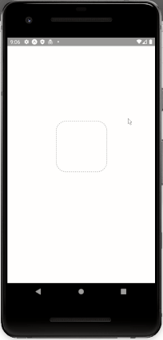

# RN Forum Demo App

This is a demo app using React Native and it's purpose is to list data from an api and have a details view.

## Demo



## Installing

To get the application running first follow these steps after cloning the repo:

```
yarn
```

```
yarn start
```

After this 'Metro Bundler' and 'Expo DevTools' should be running. Depending on your requirements use a emulator or a physical device to run the application.

## Running the tests

Move into the root directory of the project and run yarn test.

## Authors

* **Besnik Korca** - *Initial work* - [besifear](https://github.com/besifear)

## License

This project is licensed under the MIT License - see the [LICENSE.md](LICENSE.md) file for details
